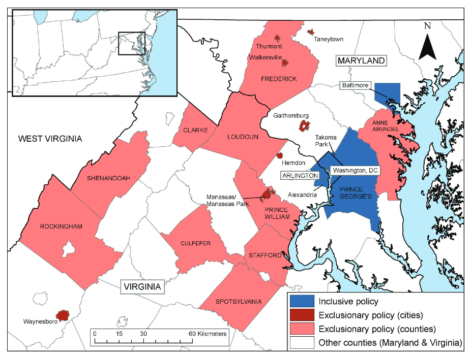
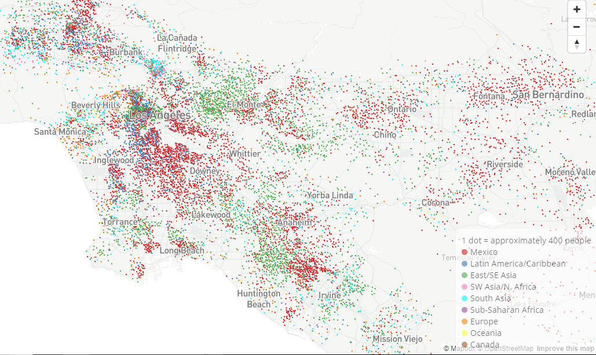
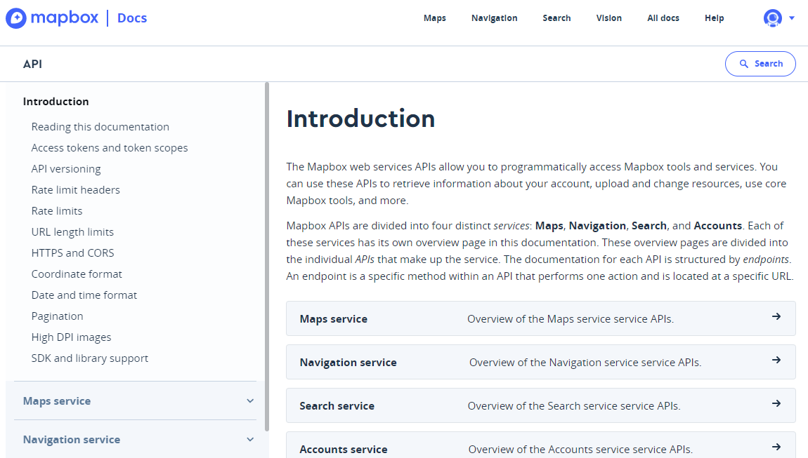

```{r setup, include=FALSE}
options(htmltools.dir.version = FALSE)
options(tigris_use_cache = TRUE, tigris_year = 2018)

knitr::opts_chunk$set(message = FALSE, warning = FALSE)
```

```{r xaringan-themer, include=FALSE, warning=FALSE}
library(xaringanthemer)

style_xaringan(title_slide_background_color = "#035004", 
                     text_color = "#035004", 
                     header_color = "#035004", 
                     inverse_background_color = "#035004",
                     text_font_family = "Gotham Narrow",  
                     header_font_family = "Helvetica", 
                     header_font_weight = "bold", 
                     link_color = "#1a730f")
```

class: middle, center, inverse

## Introduction: research & open source software

---

## My academic research before R



---

## Spatial R and the tidyverse


---

## tigris

* My first R package; first released in 2015

* Automates acquisition and loading of US Census Bureau TIGER/Line shapefiles in R

```{r tigris-1}
library(tigris)
options(tigris_use_cache = TRUE)

dallas_tracts <- tracts("TX", "Dallas", cb = TRUE)

```

---

```{r tigris-2}
plot(dallas_tracts$geometry)
```


---

## tidycensus

* First released in 2017; loads data from the decennial Census or American Community survey APIs optionally pre-joined with Census shapefiles

```{r tidycensus-1, message = TRUE}
library(tidycensus)

broadband <- get_acs(
  geography = "tract",
  variables = "DP02_0152P", 
  state = "TX",
  county = "Dallas",
  geometry = TRUE
)
```
---

```{r tidycensus-2, fig.width=10}
library(mapview)

mapview(broadband, zcol = "estimate")
```


---

## Mapbox and my research

[_Mapping Immigrant America_ (2015, 2020)](http://personal.tcu.edu/kylewalker/immigrant-america/#8.95/33.9529/-118.1402)


---

## The Mapbox platform

As I discovered, there is quite a bit more to Mapbox than just Studio/GL JS...



---

## {mapboxapi}

The {mapboxapi} R package is an effort to: 

* Help R users incorporate Mapbox web services into their maps / sf-based analysis projects

* Combine Mapbox services when appropriate for common use cases

* Use R as a bridge between analysts' data pipelines & visualization projects (with Leaflet, tippecanoe, Mapbox Studio, etc.)

---
class: middle, center, inverse

## Tutorial: using Mapbox APIs in R
