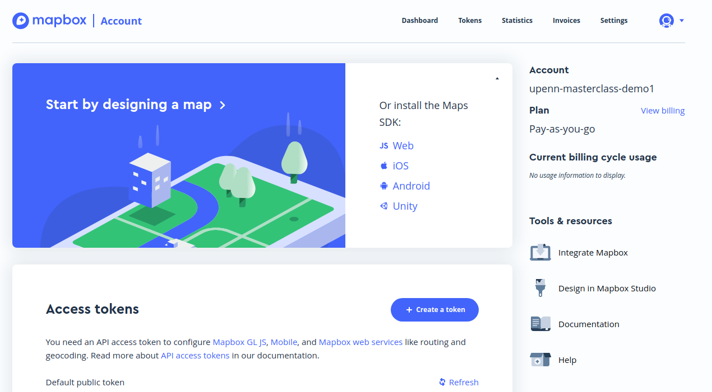

```{r setup, include=FALSE}
knitr::opts_chunk$set(echo = TRUE, message = FALSE, warning = FALSE)
```

# Getting started

## Installing packages and dependencies

To get started with mapboxapi, you'll need to first install some packages. mapboxapi was just released to CRAN this week, so we can install with `install.packages()`:

```{r, eval = FALSE}
install.packages("mapboxapi", dependencies = TRUE)
```

To run the _advanced_ examples in the second half of this workshop, you'll also need to install the following packages that don't get picked up as mapboxapi dependencies:

```{r, eval = FALSE}
install.packages(c("shiny", "fasterize", "tidycensus"))
```


If you've been working with R Spatial packages before, installation should go smoothly.  If you are new to R/R Spatial, you may need to do some configuration prior to successful installation of the package.  mapboxapi depends heavily on the [sf](https://github.com/r-spatial/sf) package for spatial data processing in R.  On Ubuntu, use the following commands in a terminal to install required dependencies: 

```bash
sudo add-apt-repository ppa:ubuntugis/ubuntugis-unstable
sudo apt-get update
sudo apt-get install -y libudunits2-dev libgdal-dev libgeos-dev libproj-dev 
```

mapboxapi also uses the [protolite](https://github.com/jeroen/protolite) package for interacting with Mapbox vector tiles and the [magick](https://github.com/ropensci/magick) package for image processing and display.  On Ubuntu, install dependencies with:

```bash
sudo apt-get install -y libprotobuf-dev protobuf-compiler libmagick++-dev
```

Instructions for other Linux distributions can be found on the package websites linked above.  

## Setting up your Mapbox account

upenn-mapbox-community

Before we get started using Mapbox services in R, you'll need a valid Mapbox account with an __access token__.  Fortunately, Mapbox has generously provided a coupon code for you to use as workshop participants.  To set up your account, visit https://account.mapbox.com/auth/signup/ to establish an account - all you need to provide is an email address to sign up!  Fill out the form and verify your account through the email Mapbox sends you; you'll be taken directly to your Mapbox account dashboard page.  


Note the "default public token" that appears on your screen - you'll come back to this page in a moment.  First, look to the right side of your screen and click "View billing."  This is where Mapbox will handle your billing information.  Nothing you'll do today will be intensive enough to incur charges - but your next three months of work will be covered by the coupons Mapbox has provided to this workshop.  Scroll down and enter the coupon code you've received in the appropriate box, then click __Add__.  Once you've entered your coupon code, return to your Mapbox dashboard.  Copy the access token that appears on your screen to your clipboard, then return to R.  

### Loading mapboxapi and setting your access token

All features in mapboxapi require a valid Mapbox access token to work.  Now that you have yours in hand, you can set yours up!  Load the mapboxapi package and install your token as follows:  

```{r, eval = FALSE}
my_token <- "YOUR TOKEN GOES HERE"

library(mapboxapi)
mb_access_token(my_token, install = TRUE)

```

The optional argument `install = TRUE` saves the token to your .Renviron, allowing you to use mapboxapi functions in the future without having to worry about setting your token.  To use this feature, restart your R session.  

# Using Mapbox maps in R

The most well-known feature of Mapbox services is its ability to create stunning web maps which are used on applications all around the world.  While mapboxapi is not an interface to [Mapbox GL JS](https://docs.mapbox.com/mapbox-gl-js/api/), Mapbox's JavaScript library for building web maps, it does include some tools to help you use Mapbox maps in your R projects.  This is important as the [Mapbox Terms of Service](https://www.mapbox.com/legal/tos/) require that Mapbox API outputs be visualized on Mapbox maps.  

## Visualizing Mapbox "styles"

Mapbox maps are accessed through _styles_, which are custom design configurations applied to OpenStreetMap or even user-generated vector map tilesets.  You'll learn how to create and use your own map style with Mapbox later in this workshop.  However, Mapbox provides a number of their styles to all users with a Mapbox access token.  The most recent versions of these styles (as of the workshop date) are as follows:

* `streets-v11`: [The core Mapbox Streets basemap](https://www.mapbox.com/maps/streets)
* `outdoors-v11`: [A basemap designed for outdoor recreation uses](https://www.mapbox.com/maps/outdoors)
* `light-v10`: [A light, greyscale background suitable for thematic overlay](https://www.mapbox.com/maps/light)
* `dark-v10`: [A dark basemap suitable for thematic overlay](https://www.mapbox.com/maps/dark)
* `satellite-v9`: [A global satellite basemap derived from MODIS, Landsat, & proprietary imagery sources](https://www.mapbox.com/maps/satellite)
* `satellite-streets-v11`: The satellite basemap with a streets overlay

One of the most popular R packages for interactive data visualization in R is the [Leaflet package](https://rstudio.github.io/leaflet/) maintained by RStudio, which wraps the [Leaflet JavaScript library](https://leafletjs.com/) for web mapping.  [Years ago, I wrote a tutorial on how to use Mapbox maps in R Leaflet projects](https://rpubs.com/walkerke/rstudio-mapbox).  Now, mapboxapi provides a convenience function, `addMapboxTiles()`, to help you do this in a more straightforward way.  This function queries the [Mapbox Static Tiles API](https://docs.mapbox.com/api/maps/#static-tiles) and converts a Mapbox style into static tiles for web mapping.  

Let's load the leaflet and mapboxapi libraries and set up an interactive map: 

```{r}
library(leaflet)
library(mapboxapi)

mapbox_map <- leaflet() %>%
  addMapboxTiles(style_id = "streets-v11",
                 username = "mapbox") 

mapbox_map
```

We get a browseable Leaflet map using Mapbox tiles as a basemap.  

## Focusing your map with the Mapbox Search API

Once we've set up our Leaflet map with a Mapbox basemap, we'll likely want to focus it on a specific location.  mapboxapi includes functionality for R users to interact with the [Mapbox Search API](https://docs.mapbox.com/api/search/).  Implemented functions include `mb_geocode()` for _forward geocoding_, which refers to the conversion of a description of a place (like an address) into longitude/latitude coordinates; and `mb_reverse_geocode()`, which converts coordinates into a place description.  

Both functions default to using the `mapbox.places` API endpoint, which is to be used for _temporary geocoding_.  This means that the endpoint cannot be used to store geocoded information nor can it be used for batch geocoding (e.g., a spreadsheet of addresses).  These tasks are permissible with the `mapbox.places-permanent` endpoint, which is not included with free accounts.  In turn, R users looking for free batch geocoding solutions should use other packages [like the tidygeocoder package](https://jessecambon.github.io/tidygeocoder/).  Mapbox geocoding with the `mapbox.places` endpoint _can_ be used to focus web maps and guide navigation services, which will be illustrated in the following sections.  

Let's use `mb_geocode()` to identify the coordinates representing the University of Pennsylvania (specifically here, the university bookstore).

```{r}
penn <- mb_geocode("3601 Walnut St, Philadelphia, PA 19104")

penn
```

By default, `mb_geocode()` returns a length-2 vector representing the longitude and latitude coordinates of the geocoded location.  The function can also return an sf POINT object or an R list representing the full API response, if requested.  Using the returned coordinates, we can focus our Leaflet Mapbox map with the `setView()` function:


```{r}
mapbox_map %>%
  setView(lng = penn[1],
          lat = penn[2],
          zoom = 14)

```

## Exercise

__Try it out__! Make a Leaflet map in R using a Mapbox basemap of your choice, focused on a location of your choice.  For locations in non-English-speaking countries: `mb_geocode()` has a `language` argument that can be used to improve the accuracy of queries in languages other than English.  [Supported languages (and how to specify them) are found in the Mapbox documentation here.](https://docs.mapbox.com/api/search/#language-coverage)


# Using Mapbox Navigation APIs in R

[The Mapbox Navigation Service API](https://docs.mapbox.com/api/navigation/) includes a variety of methods for performing routing and network analysis.  mapboxapi allows R users to interact with the Navigation Service API by using the following functions: 

* `mb_directions()`: an interface to the [Mapbox Directions API](https://docs.mapbox.com/api/navigation/#directions) for calculating driving (with or without traffic), walking, or cycling routes.  Users can request routes between an origin/destination pair or along a series of points, and can return route linestrings as simple features objects along with travel instructions.  
* `mb_optimized_route()`: duration-optimized routing with the [Mapbox Optimization API](https://docs.mapbox.com/api/navigation/#optimization), helping you determine the fastest way to visit multiple locations on your route.  
* `mb_isochrone()`: uses the [Mapbox Isochrone API](https://docs.mapbox.com/api/navigation/#isochrone) to draw _isochrones_ around specified locations, which represent the reachable area from those locations within a given travel time by a given travel mode.  
* `mb_matrix()`: for a specified set of origin and destination locations, uses the [Mapbox Matrix API](https://docs.mapbox.com/api/navigation/#matrix) to calculate pairwise travel times between those locations.  This function is recommended for smaller travel-time matrices; large matrix requests (e.g. with results exceeding the tens of thousands) should be completed with a user-installed routing engine like [Valhalla](https://github.com/valhalla/valhalla) or [OSRM](http://project-osrm.org/).  

The fifth Mapbox navigation service, [map matching](https://docs.mapbox.com/api/navigation/#map-matching), is not yet supported by mapboxapi but will be in a future release.  

## Drawing isochrones with Mapbox and R

Creating and visualizing isochrones is straightforward with the `mb_isochrone()` function in mapboxapi.  Supported travel profiles include driving (with no traffic), cycling, and walking.  `mb_isochrone()` by default returns a simple features polygon object that can be used for visualization and even spatial analysis.  

Let's try drawing isochrones around the Penn campus.  `mb_isochrone()` accepts an an input a coordinate pair, a location description as a character string, or an sf object.  We can use our `penn` object here to initialize the isochrones around campus.  

```{r}
penn_isochrones <- mb_isochrone(penn,
                                profile = "driving",
                                time = c(4, 8, 12))

penn_isochrones
```

An sf object is returned with a `time` column representing the travel-time around the location.  `time` is organized in descending order to ensure that overlapping isochrones are plotted correctly, with the shortest time visualized last (on top).  

Using Leaflet's `addPolygons()` function, we can add the isochrones to our map. 

```{r}
colors = viridisLite::viridis(3)

mapbox_map %>%
  addPolygons(data = penn_isochrones,
              color = rev(colors),
              fillColor = rev(colors),
              fillOpacity = 0.5, 
              opacity = 1, 
              weight = 0.2) %>%
  addLegend(labels = c(4, 8, 12),
            colors = colors,
            title = "Drive-time<br/>around Penn")
```

The filled areas represent the estimated reachable area around Penn without traffic.  The Mapbox API does not support traffic-adjusted isochrones, so isochrone results should be interpreted appropriately depending on what you plan to represent.  


## Routing with mapboxapi

mapboxapi can also be used to quickly represent and visualize routes between two locations, or alternatively along multiple locations.  The Mapbox Directions API endpoint has _a lot_ of options, which I've done my best to implement for R users.  At its simplest, however, `mb_directions()` just requires an origin and a destination: 

```{r}
route <- mb_directions(origin = penn,
                       destination = "Philadelphia Museum of Art, Philadelphia PA",
                       profile = "cycling")

mapbox_map %>%
  addPolylines(data = route, 
               popup = paste0(
                 "Distance (km): ",
                 round(route$distance, 1), 
                 "<br/>Time (minutes): ",
                 round(route$duration, 1)
               ))
```

The optional argument `steps = TRUE` will break the route object into separate rows for each leg of the trip, and return travel instructions in a number of different languages (English is the default). 

```{r}
route_dir <- mb_directions(origin = penn,
                           destination = "Philadelphia Museum of Art, Philadelphia PA",
                           profile = "cycling",
                           steps = TRUE)

route_dir
```
## Exercises

Now that you've learned how to use isochrone and routing services in mapboxapi, try them out for yourselves!  Create the following maps:  

1. An isochrone map around a location of your choice.  Times can be specified at 1-minute intervals all the way up to 60 minutes using a vector. 
2. A route between two locations of your choice, using a travel profile of your choice. 


# Analyzing elections and accessibility with mapboxapi

At the time of this workshop (October 9, 2020), the November 3rd election is less than a month away.  This election is accompanied by massive questions around voter safety during the COVID-19 pandemic and voter suppression with unfounded concerns about voter fraud and mail-in ballots.  In my home state of Texas, [the governor has limited absentee ballot drop-off sites to one per county](https://www.cnn.com/2020/10/01/politics/texas-governor-drop-off-locations-ballots/index.html), creating significant accessibility issues for residents of large Texas counties.  

Election accessibility can be analyzed using Mapbox services and the mapboxapi package.  While the above examples are useful for quick queries and web mapping, my primary motivation for writing mapboxapi was _to use Mapbox services for spatial data science tasks in R_.  As I already used Mapbox services heavily for my visualization projects, it made sense to write mapboxapi to connect these services with my existing sf-based data science workflows.  

In this section of the workshop, we'll explore three more advanced applications of mapboxapi within practical spatial data science workflows.  We'll examine how to visualize accessibility to a ballot drop-off location in Houston; identify areas where populations may have difficulty reaching early voting locations in Fort Worth; and build a routing app with Shiny that identifies the closest polling place to a user's address.  This section may include some new concepts or techniques - but it is designed to illustrate where you can go with mapboxapi in your work!


## Visualizing (in)accessibility to ballot drop box locations

The tools we've learned how to use with mapboxapi can be used to analyze relative accessibility - or inaccessibility - to polling or ballot drop-off locations.  Limiting ballot drop-off locations in Texas counties creates significant accessibility issues for Texas voters.  For example, Harris County (Houston) will have one drop-off location for its 4.6 million residents, whereas many other counties in Texas have the same number of drop-off locations for populations smaller than 1,000.  

We can visualize this situation in Harris County with _layered isochrones_.  We already used this technique to show multiple drive times around the University of Pennsylvania earlier in this tutorial.  In this case, we will use `mb_isochrone()` to generate dozens of isochrones, then visualize them simultaneously to illustrate an accessibility gradient in the region.  

We'll first generate the isochrones using a vector of times, 1 through 45 at 1-minute intervals.  

```{r}
library(mapboxapi)

isos <- mb_isochrone(
  location = "201 Caroline St, Houston TX 77002",
  profile = "driving",
  time = 1:45
)
```


Next, we can visualize our overlapping isochrones.  We'll use the viridis color palette as we did previously in the tutorial, and generate a color palette derived from the `time` column in our dataset.  Once specified, we can add these polygons to our Mapbox basemap with a mostly-transparent fill opacity.  

```{r}

pal <- colorNumeric("viridis", isos$time, na.color = "transparent")

mapbox_map %>%
  addPolygons(data = isos,
              fillColor = ~pal(time),
              stroke = FALSE,
              fillOpacity = 0.1) %>%
  addLegend(values = isos$time,
            pal = pal,
            title = "Drive-time to Harris<br/>County Clerk")

```


The result illustrates some of the wide differences in accessibility between various parts of the region.  One notable issue with this visualization approach, however, is that the layering of isochrones in the interior of Houston makes it difficult to view the basemap beneath them.  This can be resolved by converting to a _raster dataset_ and generating an "accessibility surface" for improved visualization.  

### Making an "accessibility surface"

_Accessibility surfaces_ are commonly used in geographic information systems applications to identify the distance from any particular location to a geographic feature of interest.  We can apply this concept to network-based accessibility by using mapboxapi tools.  To create the accessibility surface, we will convert our isochrones to a raster dataset using the [fasterize package](https://github.com/ecohealthalliance/fasterize).  Raster datasets represent geographic information as _grid cells_ defined by a cell size.  Higher-resolution raster datasets are represented with smaller cell sizes.  

To generate the accessibility surface raster, we will need to apply a _coordinate system transformation_ to "project" our data to two-dimensional coordinates.  This will allow us to specify the raster's resolution in meters.  We generate a 100m resolution raster, and use the `fasterize()` function to allocate the minimum overlapping value from our isochrones to each grid cell.  The result can then be mapped with Leaflet's `addRasterImage()` function.  

```{r}
library(fasterize)
library(sf)

isos_proj <- st_transform(isos, 32615)

template <- raster(isos_proj, resolution = 100)

iso_surface <- fasterize(isos_proj, template, field = "time", fun = "min")

mapbox_map %>%
  addRasterImage(iso_surface, colors = pal, opacity = 0.5) %>%
  addLegend(values = isos$time, pal = pal,
            title = "Drive-time to Harris<br/>County Clerk")

```

Accessibility is now represented in a similar way, but with a clearer view of the basemap around downtown Houston.  


## Identifying populations who may have difficulty reaching polling places

The previous 


```{r}
library(tidyverse)
library(tidycensus)

ev_sites <- read_rds("data/tarrant_EV_sites.rds")

walking_isos <- mb_isochrone(
  ev_sites,
  profile = "walking",
  time = 20
)

```

```{r}
mapbox_map %>%
  addPolygons(data = walking_isos)
```

### Obtaining demographic data with tidycensus

```{r}
library(tidycensus)
options(tigris_use_cache = TRUE)

no_cars <- get_acs(
  geography = "tract",
  variables = "DP04_0058P",
  state = "TX",
  county = "Tarrant",
  geometry = TRUE
)
```

```{r}
driving_pal <- colorNumeric("viridis", no_cars$estimate)

mapbox_map %>%
  addPolygons(data = no_cars,
              fillColor = ~driving_pal(estimate),
              fillOpacity = 0.5,
              stroke = FALSE,
              smoothFactor = 0.1) %>%
  addLegend(values = no_cars$estimate,
            pal = driving_pal,
            title = "% without access<br/>to automobile")

```

### Performing spatial analysis with sf

```{r}
library(dplyr)

target_areas <- no_cars %>%
  st_transform(4326) %>%
  filter(estimate >= 15) %>%
  st_difference(
    st_union(walking_isos)
  )


mapbox_map %>%
  addPolygons(data = target_areas)
```

## Building a polling place locator app with Shiny

<iframe src="https://walkerke.shinyapps.io/mapbox_voting_locator/" width="600" height="800" frameBorder="0"></iframe>

<style>

h1, h2, h3 {
  color: #035004; 
  font-family: "Verdana"
}

body {
  font-family: "Verdana"
}

a {
  color: #1a730f; 
}

.inverse {
  background-color: #035004; 

}

.list-group-item.active, .list-group-item.active:focus, .list-group-item.active:hover {
    z-index: 2;
    color: #fff;
    background-color: #035004;
    border-color: #035004;
}


</style>


